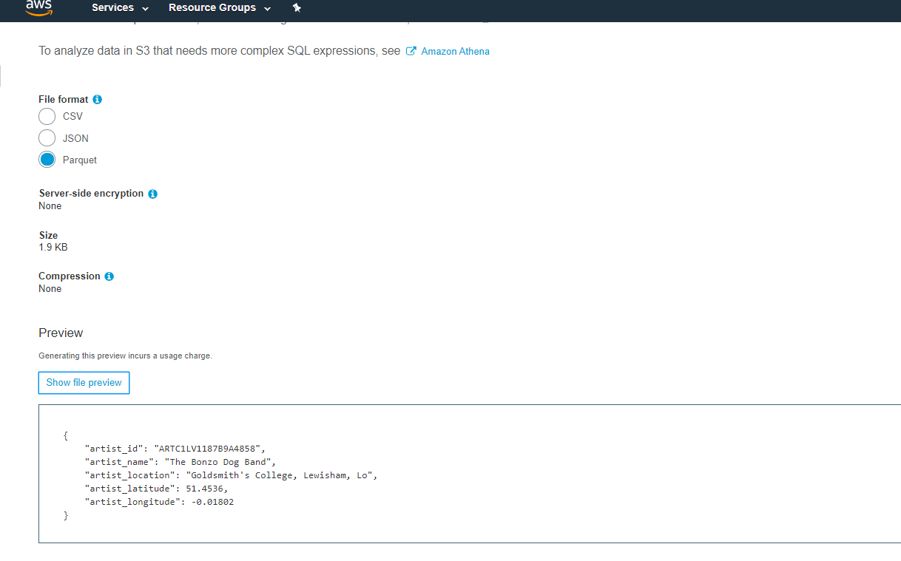
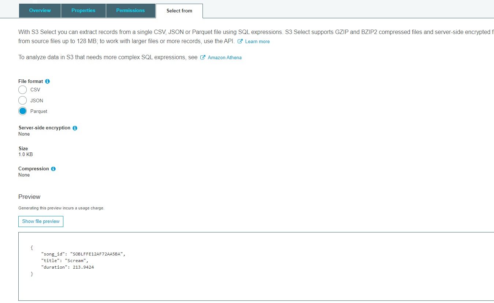
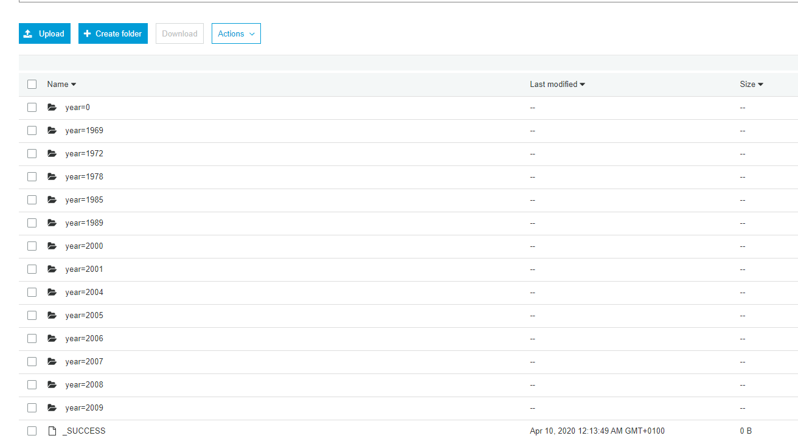

# Data Lake ETL (Spark - AWS)

##### (Udacity Data Engineer Nano Degree Project 4)
---------------

**Introduction**


A music streaming startup, Sparkify, has grown their user base and song database even more and want to move their data warehouse to a data lake. Their data resides in S3, in a directory of JSON logs on user activity on the app, as well as a directory with JSON metadata on the songs in their app.


**The Goal**

In this project, as their data engineer, we are tasked with building an ETL pipeline that extracts their data from S3, processes them using Spark, and loads the data back into S3 as a set of dimensional tables. 

**Database Source**

The source data is in log files given the Amazon s3 bucket:

 - Song data: s3://udacity-dend/song_data
 - Log data: s3://udacity-dend/log_data

**song_data** is in JSON format and contains metadata about a song and the artist of that song. The files are partitioned by the first three letters of each song's track ID. 


 ``` python
# An example of what a single song file

{"num_songs": 1, "artist_id": "ARJIE2Y1187B994AB7", "artist_latitude": null, "artist_longitude": null, "artist_location": "", "artist_name": "Line Renaud", "song_id": "SOUPIRU12A6D4FA1E1", "title": "Der Kleine Dompfaff", "duration": 152.92036, "year": 0}
 ```

**log_data** consists of log files in JSON format generated by this event simulator based on the songs in the dataset above. These simulate app activity logs from an imaginary music streaming app based on configuration settings.

An example of what the data in a log file


**Structure**

The tables have been arranged in a star schema.

***Fact Table***

The `songplays` table is the fact table and it contains foreign keys to dimension tables.
- songplay_id
- start_time
- user_id
- level
- song_id
- artist_id
- session_id
- location
- user_agent

***Dimension Tables***

- `users` - user_id, first_name, last_name, gender, level
- `songs` - song_id, title, artist_id, year, duration
- `artists` - artist_id, name, location, lattitude, longitude
- `time` - start_time, hour, day, week, month, year, weekday


The project contains the following components:

- **etl.py** reads data from S3, processes that data using Spark, and writes them back to S3
- **dl.cfg** contains your AWS credentials


**Data Pipeline** 

In this project most of ETL is done with Python:

- Firstly reads song_data and load_data from S3.
- Transforms them to create fact and dimension tables.
- Writes them to partitioned parquet files in table directories on S3.

check out the etl.py


**To run the program**

- python etl.py will execute for ETL

**Project Examples**









-----
NOTE: End of the project S3 bucket has been deleted

Hazal Ciplak
